# MATLAB SWARM ROBOTIC SIMULASYONU

##### 1. Ana ekran:

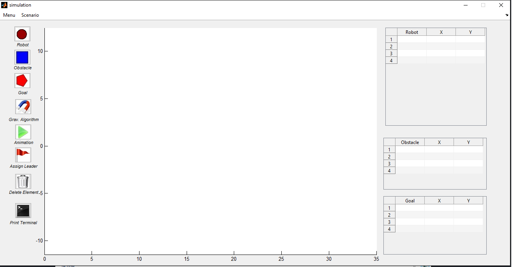

##### 2. Butonlar ve Anlamları

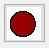
__ Panelde rastgele koordinata robot ekler __

__ Panelde rastgele koordinata engel ekler __

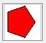
__ Panelde rastgele koordinata hedef ekler __

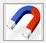
__ Kütle çekim algoritmasını çalıştırır __

__ Kütle çekimleri hesaplanmış robotlar için animasyonu başlatır __

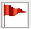
__ Lider atama algoritmasını çalıştırır. __

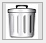
__ Belirtilen tipte elemanı (Robot, Engel, Cisim) panelden siler __

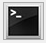
__ Bütün elemanların özelliklerini workspace'e basar __

##### 3. Programın Çalışması

* Programa Robot, Engel ve Cisim elemanları butonlar yardımıyla random olarak eklendiği gibi işaretçi ile üzerine istenilen yere de eklenebilir.

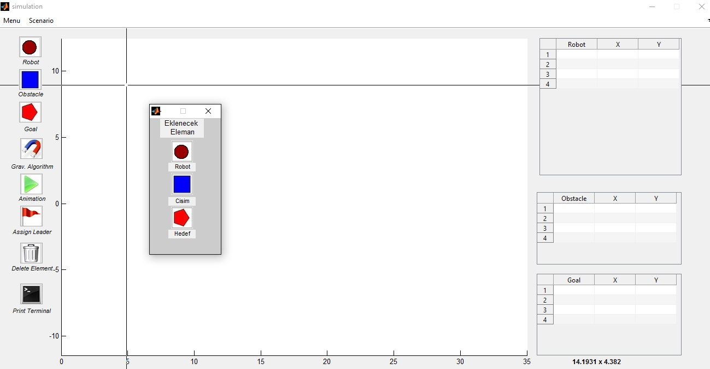

##### 4. Senoryo Kaydetme & Açma

* Programda, mevcut senaryoyu __Scenario > Save Scenario__  seçeneği ile kaydedebilir ve kayıtlı senaryoyu __Scenario > Load Scenario__ seçeneği ile tekrar yükleyebilirsiniz. Kaydedilen senorya __*.sec__ uzantılıdır.

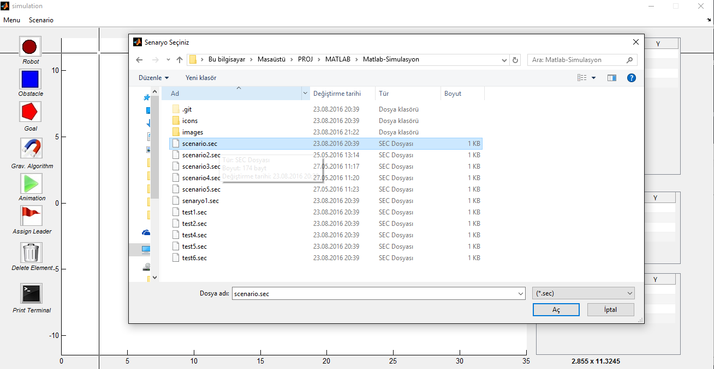

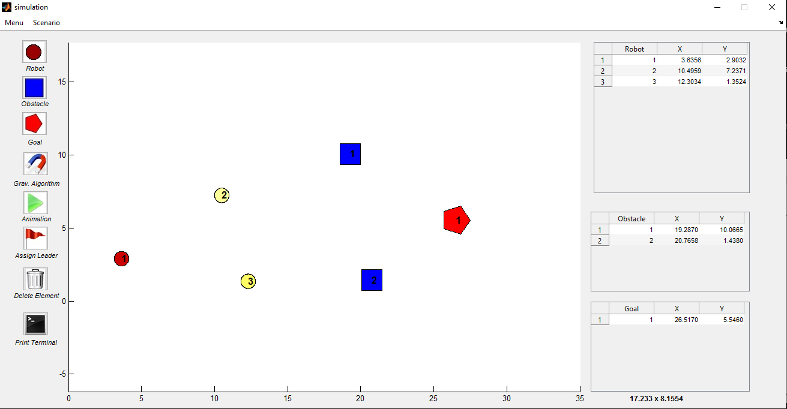

##### 5. Kütle Çekim Algoritmasını Çalıştırma

* Programda, kütle çekim algoritması  butonuna basarak çalıştırılır ve her bir robot için toplam çekim değeri hesaplanır. Kütle çekim değerleri hesaplanan robotların hareketleri  butonu ile sağlanır. Bu sayede robotlar, belirlenin kütle çekim değerine kadar birbirlerine yaklaşırlar.

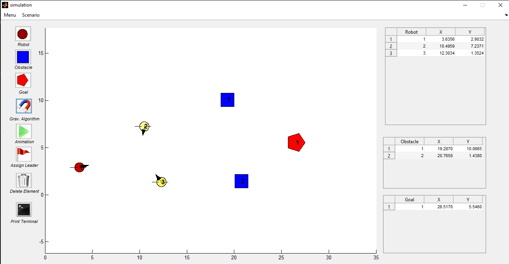

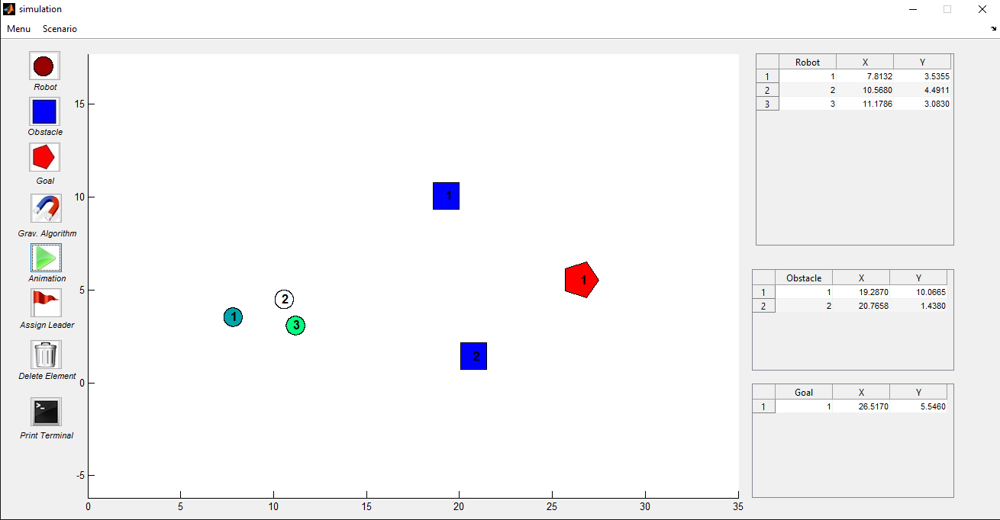

##### 6. Lider Atama Algoritması
* Kütle çekim algoritması hesaplanım animasyon çalıştırıldıktan __sonra__ lider atama algoritmasına seçilir.  butonu lider atama algoritmasını çalıştırır ve algoritma gereği decenteralize olarak lider ataması yapılır. Lider olarak atanan robot kırmızı daire ile gösterilmektedir.

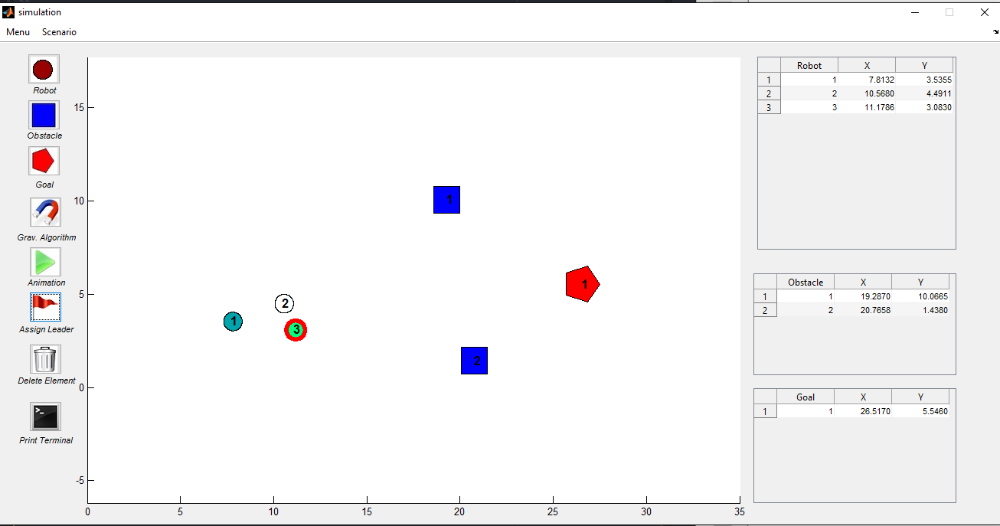

##### 7. Kütle Çekimi & Ağırlık Merkezi Algoritması
* Lider ataması yapılan robotlar için bir sonraki aşama hedefe yönelme aşamasıdır. Bu aşamada lider robot hedefe yönelirken lideri takip eden robotlar da hedef araması yaparken; diğer yandan grup alanını korumaya çalışırlar.
* Robotların hedefe yönelebilmesi için kütle çekim algoritmasının tekrar çalışması gerekmektedir. Bunun için kütle çekim algoritmasını çalıştıran  butonuna tekrar basılarak robotlara kütle çekim kuvveti verilir.
* ilk değerleri atanmış robotların hareket edebilmesi için  butonuna tekrar basılır. Robot kolonisi hedefini bulana kadar hareketine devam edecektir.

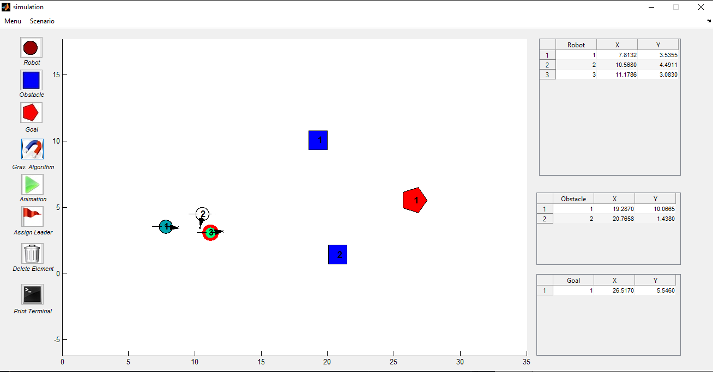

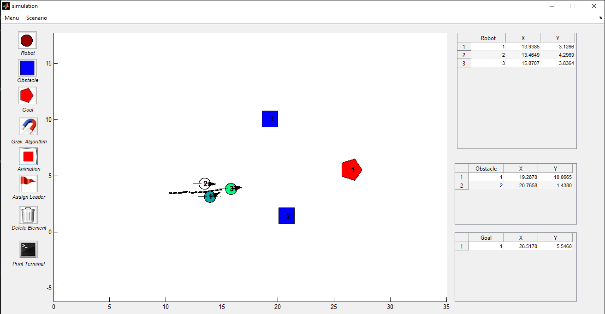

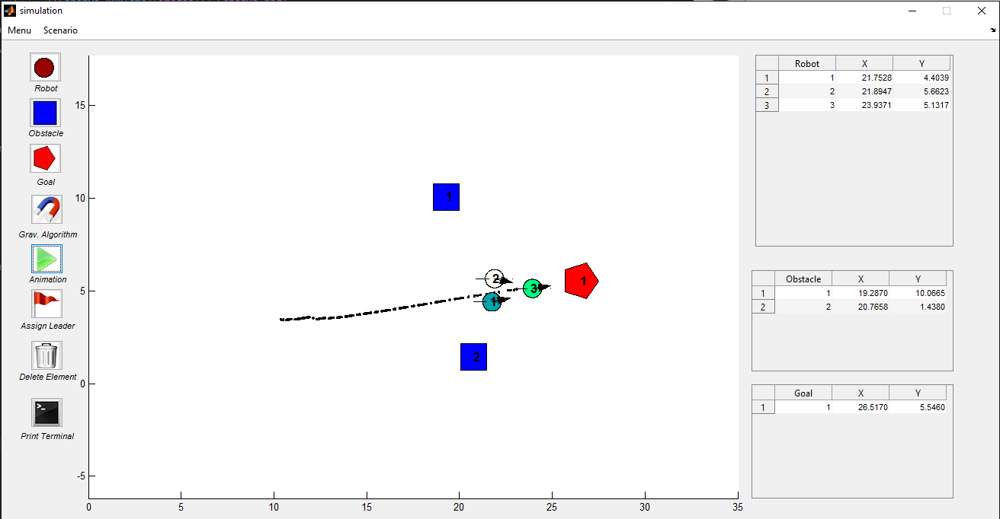

##### Görüntüleme Seçenekleri
* __Menu > Ayarlar__ sekmesi altında panel görüntülenme seçenekleri değiştirebilmektedir.

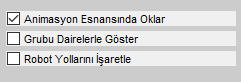
