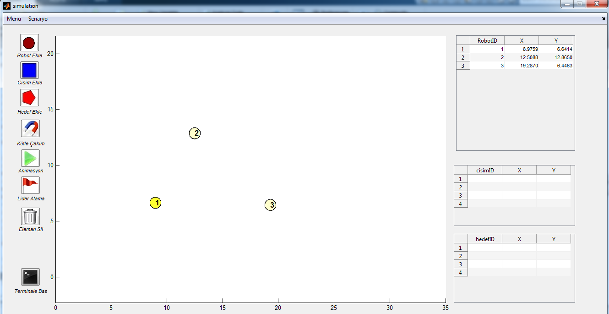
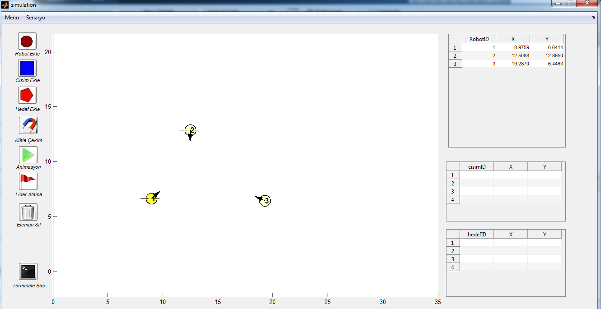
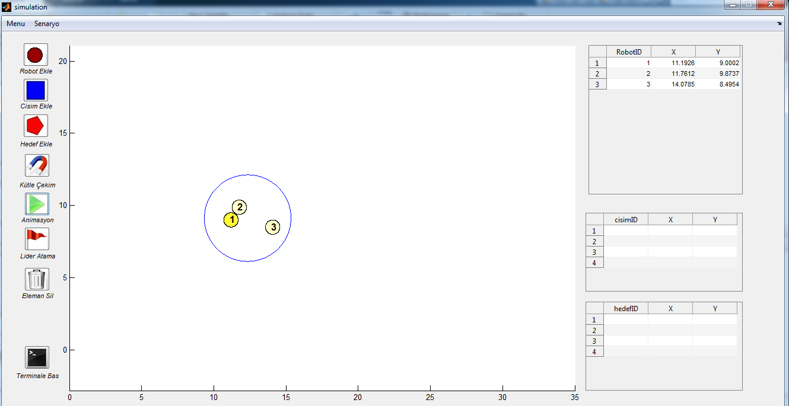
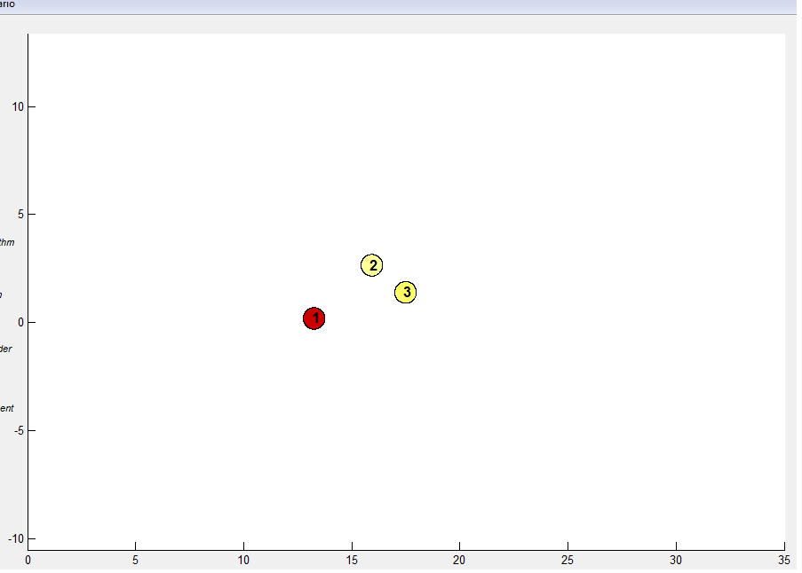
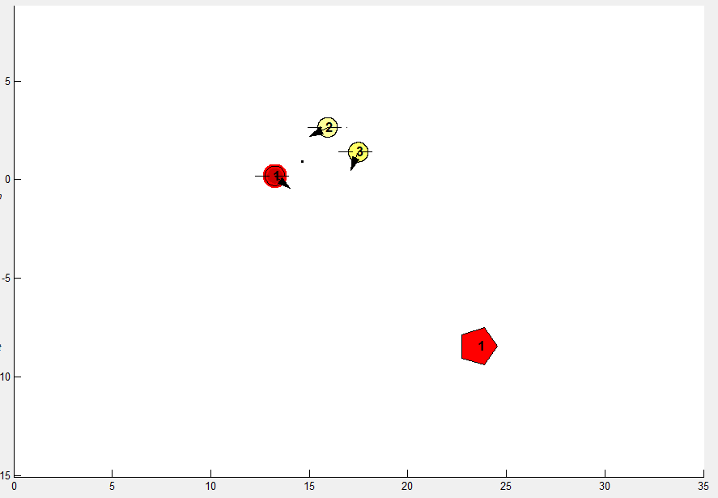
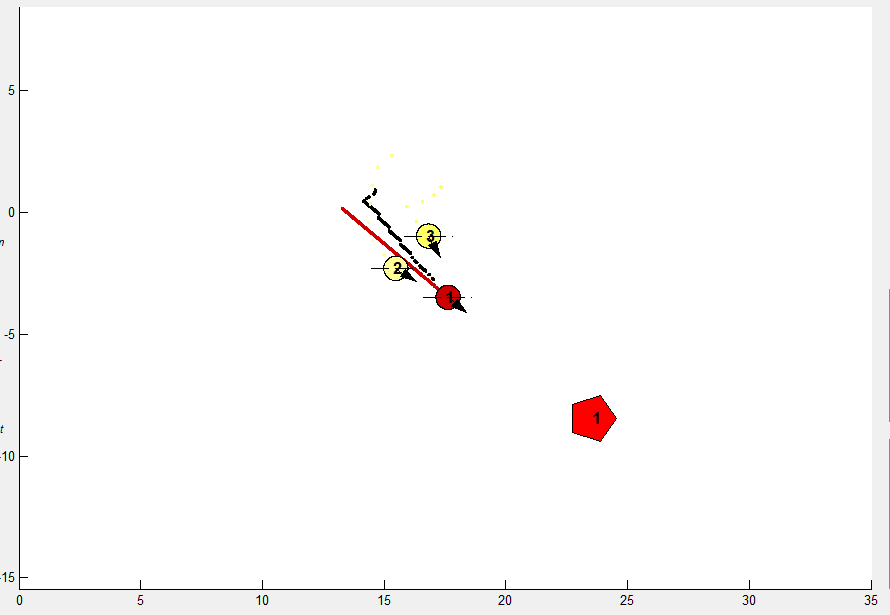
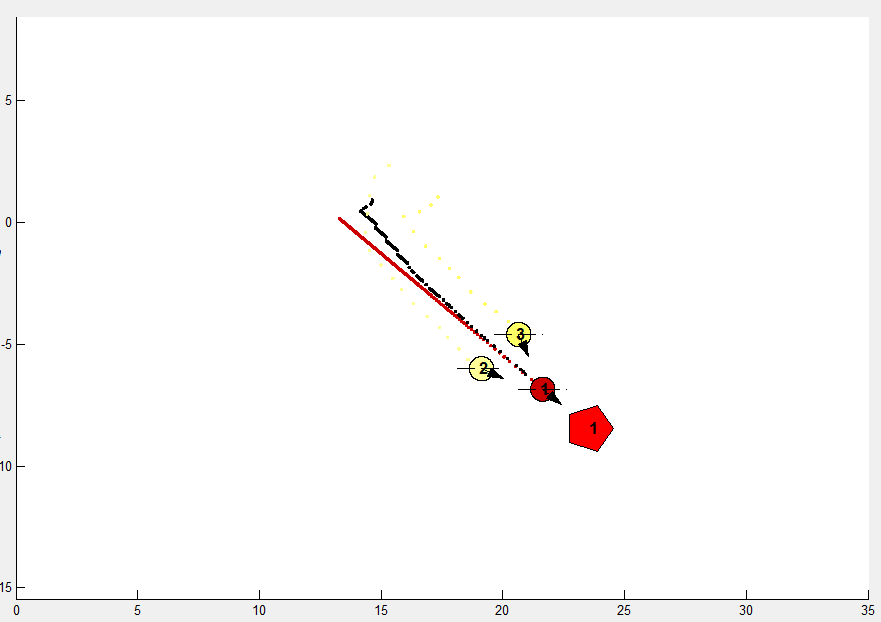
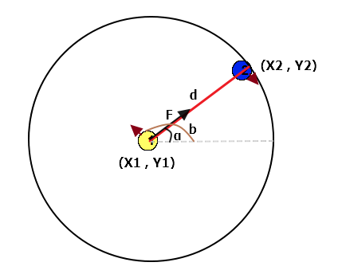

# Robot Gruplanma Algoritması Simulasyonu

Matlab tabanlı bu simulasyon; n-sayıda ve rastgele konumlara yerleştirilmiş robotlar için belli bir merkeze bağlı olmadan (decenteralize) önceden belirlenmiş sayıda robot kolonisi için farklı bir gruplanma algoritması sunar.

### Programa Bakış
Programa ait ana ekran aşağıdaki gibidir.

## Senaryo
Robotlar; hedeflerin ve engellerin de bulunduğu bir ortamda rastgele dizilmişlerdir.
Simulasyon;

1. Robotların kendi iradesiyle (otonom) hareket etmeleri,

2. Robotların hız, konum, sensör vs. bilgilerinin değerlendirildiği merkezi bir işlem birimi olmadan (decenteralize), kendi içersinde karar vermeleri,

3. Robotların ilk durumda engellerden kaçarak önceden belirlenmiş bir sayıda gruplanmaları,

4. Gruplanmış robotların belirlenen hedefi grup olarak aramaları ve bulmaları.

görevlerini, geliştirilen algoritmalarla yerine getirmektedir.

Robotlar simulasyona manual veya random olarak eklenebilir.

Her bir robot üzerinde mesafe ölçmeye yarayan lazer uzaklık sensörü vardır. Dolayısyla robotların bulunduğu dünya düşünüldüğünde her bir robotun elde edebildiği tek veri, kendisi dışındaki elmanlara olan uzaklığıdır.

## Algoritma Tasarımı

Robotların birbirinden habersiz olarak ve decenteralize şekilde gruplanmasında **Newton Evrensel Kütle Çekim Kanunu** kullanılmıştır.

Kütle çekimi, nesnelerin birbirlerine doğru çekme kuvveti uygulamasına denir. Bu çekme kuvveti; cisimlerin kütleleriyle doğru orantılı, merkezleri arasındaki uzaklığın karesiyle de ters orantılıdır.

simulasyonda her bir robot için ilk olarak bir kütle ataması yapılmıştır. bu kütle izafi bir değer olup sistemin tepkilerine göre güncellenmektedir. Bu konu ilerleyen aşamalarda anlatılacaktır.

Robotun üzerindeki donanımlar lazer ile sınırlı olduğunda her bir robot için elde edilebilecek en güvenilir bilgi, robotun diğer robotlara olan uzaklık bilgisidir. Bu uzaklık bilgisi kullanılarak aşağıdaki algoritma geliştirilmiştir:

#####Yakınlaşma Algoritması

* Başlangıçta ortama rastgele yerleştirilmiş her bir robot, lazerden aldığı uzaklık verilerini kullanarak sırasıyla diğer roboların kendisine uyguladığı çekim kuvvetlerini hesaplar.
* Bütün çekim kuvvetleri hesaplanan robot, bileşke kuvvet ve yön doğrultusunda hareket eder.
* Kütle Çekim doğrultusunda hareket eden robot, belirli bir değere çıktığında hareketini sonlandırır.

######Algoritmanın panelde gösterimi:

*ilk durum*

*robotların lazer verisi kullanarak hesapladığı tüm kütle çekimlerin bileşeleri gösterilmiştir.*

*Bileşke kuvvet yönünde hareket eden robotlar önceden belirlenmiş limit kütle çekim değerine ulaştığında durular*

Birbirlerine limit değer kadar yakınlaşan robotlar, gruplanmak için hazır haldedir.

Gruplanan robotların grup olarak hareket etmesi ve hedef taraması yapması amaçlanmıştır. bu noktada gruba ait robotların birbirleriyle ve diğer robotlarla anlık olarak haberleşmesi ve konum bilgilerini anlık paylaşmaları gerekmektedir. Donanımsal sınırlar göz önünde buludurulduğunda bu iletişim yoğunluğu sıkıntılara yol açmaktadır.

Bu sebeple robot grupları içerisinde bir hiyerarşi oluşturulmuştur. Her robot grubunun bir lideri vardır. Gruba ait diğer üye robotlar bu lider üzerinden haberleşirler. Lider robotlar ise diğer guruplara ait lider robotlar ile haberleşme yeteneğine sahiptir. Robot kolonilerinin bu yöntem ile daha verimli biçimde alan taraması yapması amaçlanmıştır.

#####Gruplama ve Lider Atama Algoritması

Yakınlaşma algoritması kullanarak birbirlerine yeterince yaklaşan robotlar arasında aşağıdaki algoritma kullanılarak bir lider seçilecek ve gruplama yapılacaktır.

* Yeterince yaklaşan (limit çekim değerine ulaşan) robot elindeki lazer verisi ile kendisine yakın olan robotları tespit eder.
* Robot Kendisini orijin kabul ederek, sırasıyla diğer robotların koordinatlarını inceler.
* Koordinatları incelenen robotların, orijin kabul edilen robota göre trigonometrik düzlemde hangi bölgeye ait olduğunu belirlenir.
* Robot, araştırdığı diğer robotlar içerisinde *(grupsayısı - 1)* sayıda robotu aynı trigonometrik bölgede yakalayabilirse Kendisini lider ilan eder.

######Örnek Senaryo:

Bahsedilen algoritma şekildeki gereği;

* ilk olarak 1 nolu robot kendisini orijin( 0 , 0 ) kabul ederek sırasıyla kütle çekim değeri limitin üzerinde olan diğer robotların koordinatlarına bakarak bölgelerini hesaplayacak:

  * **1 Nolu Robot için; 2 ve 3 nolu robot I.Bölgede,**
  * 2 Nolu Robot için; 1 nolu robot III.Bölgede, 3 Nolu Robot IV.Bölgede,
  * 3 Nolu Robot için; 2 nolu robot II.Bölgede, 1 Nolu Robot III.Bölgede,

  değerlere bakıldığında, diğer robotları aynı bölgede yakalayabilen tek robot 1 Nolu robot olduğundan 1 nolu robot grup lideri, diğer robotlar ise grup üyesi robotlar olarak atanacaktır.

  Bahsedilen lider ataması algoritması **decenteralize** özelliklere sahiptir. Çünkü robotlar limit çekim değerine ulaştıktan sonra bu algoritmayı çalıştırıp kendisinin lider olup olamayacağını, eğer lider olabilecek konumda değilse grup içerisinde kimin lider olacağını kestirebililir.

Lider atama algoritması kullanılarak lidere ve üyelere sahip olan robot kolonileri için bir sonraki aşama, ortam taraması yaparak hedef aramadır. hedef aramanın verimli şekilde çalışabilmesi için robot kolonileri arasında ortam taraması konusunda bölgelere ayrılma söz konusu olmalıdır. Bu ayrılma kolonilerde liderler aracılığıyla iletişime geçerek olmalıdır. üye robotlar ise lider eşliğinde koloni içerisinde kalarak ortam taraması yapacaklardır. Üyelerden herhangi biri hedefi bulduğunda liderle iletişime geçip lideri hedef doğrultusunda yönlendirme yeteneğine sahiptir.

##### Grup Olarak Hareket için Ağırlık Merkezi Algoritması

Lider ataması yapılmış ve gruplanmış robotlar, hedef araması yaparken bu grup alanı içerisinde kalmalı ve alan taramasını bu şekilde yapabilmeliler. Bu sebeple her bir grubun sahip oldu bir ağırlık merkezi noktası ve bu noktanın sahip olduğu bir kütlesi vardır. lider robot alan taraması yaparken ağırlık merkezini değiştirmektedir. Grup üyesi diğer robotların gruptan ayrılmaması ve lideri takip edebilmesi için yapması gereken tek davranış grubun sahip olduğu bu ağırlık merkezi noktasını takip etmesi olacaktır.

*Koloni içinde ağırlık merkezi hesaplaması. Siyah nokta ağırlık merkezini göstermektedir.*

*Liderin hedefe yönelmesi ve üye robotların ağırlık merkezi takibi*

*Liderin hedefe ulaşması ve üye robotların ağırlık merkezine ulaşmaları*

## Uygulama

Robotlar gruplama , yaklaşma , hedefe yönelme gibi dahvranışların tamamında Newton Evrensel Kütle Çekim Kanunu'nu kullanmaktadır. Geliştirilen Algoritmalardaki farklılık (cisimden kaçma vs. gibi) robotların sahip oldukları çoklu kütle değerlerinden kaynaklanmaktadır.

Her robot bireysel olarak, ortamda bulunan cisimlerden kaçmakla sorumludur. dolayısıyla cisimin robota uyguladığı kuvvet negatif yöndedir.

Ortamda bulunan henüz gruplanmamış robotlar için diğer robotlar pozitif yönde çekim kuvveti uygularken, gruplanmış robotlar birbirine itme kuvveti uygulamaktadır.  

#####Yakınlaşma Algoritması Uygulaması

Ortamdaki tüm robotlar lazerden aldığı uzaklık verisini belirli periyotlarla değerlendirir ve o anki kütle çekim kuvvetini hesaplar. Robotlar, hesapladığı yön ve kuvvet doğrultusunda hareket ederler.
Önceden belirlenmiş olan kuvvet büyüklüğüne ulaşana kadar hareketi devam eden robotlar bu değere ulaştıklarında dururlar.

######Lazer Verisi Kullanarak Kütle Çekim Hesabı

Yukarıda [1] Nolu robotun lazerden aldığı veri alfa(a) ve [2] Nolu robota olan uzaklığı d olsun.

[2] Nolu robotun koordinatları: ( *X1 + sin(a) * d* , *Y1 + cos(a) * d*) olur.   
