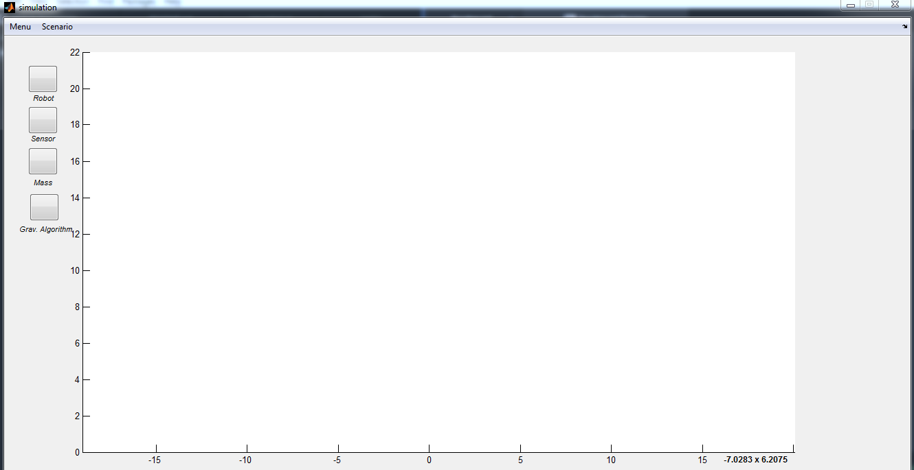
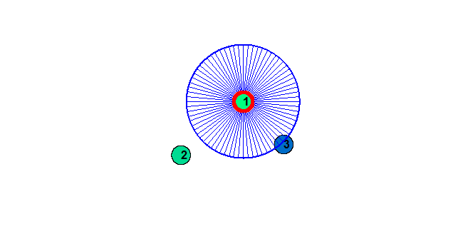
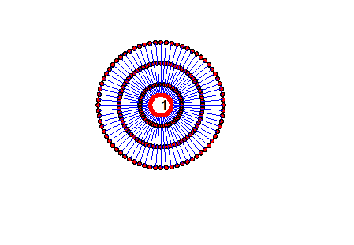
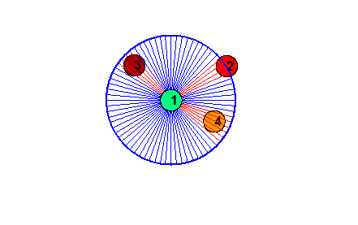

## Matlab ile lazer simulasyonu

### Panel
Simulasyon için hazırlanan panel aşağıdaki gibidir.



Robotlar sisteme manual olarak **mouseClick** eventi ile eklenmektedir.


**mouseHover** eventi ile roborların üzerinde gezildiğinde robot seçilmesi özelliği eklenmiştir.

Seçili robotun üzerine tıklandığında robota ait sensör verisine ulaşılmaktadır.



Lazer sensörüne ait değişkenler __laserInfo.m__ classı içinde bulunmaktadır.

lazerInfo.m:

```
classdef laserInfo
    % Panelde o an seçili robot için tutulması gerekilen değerler.
    properties(Constant)
        range = 3 % Lazerin sahip olduğu range değeri
        interval = 5 % Lazerin sahip olduğu ışınların sıklık değeri
    end
end
```

### Lazer Simulasyonu ile Robot Algılama

Robotun bulunduğu konumdan lazerin taradığı uzaklığa kadar gönderilen ışınların doğrultusunda robotun olup olmadığı kontrol edilmektedir.

Sistemin optimize çalışması bakımdan gönderilen ışın doğrultusunda belirlenen noktalar arasında robot varlığı sorgulanmıştır.

Gönderilen her ışının gönderildiği eğim değeri bellidir. dolayısıla algoritma her bir ışın için; belirli aralıklarla ışın üzerinde noktalar belirlemekte ve bu noktada robot olup olmadığını sorgulamaktadır. belirlenen noktalar arasındaki mesafe robotun çapı kadardır. Işın üzerinde belirlenen noktalara ait program çıktısı aşağıdaki gibidir:



Program bahsedilen algoritmayla istenilen şekilde çalışmaktadır.
Örnek çıktı: (Uzaktaki robota çarpan ışınlar kırmızı ile gösterilmiştir.)


